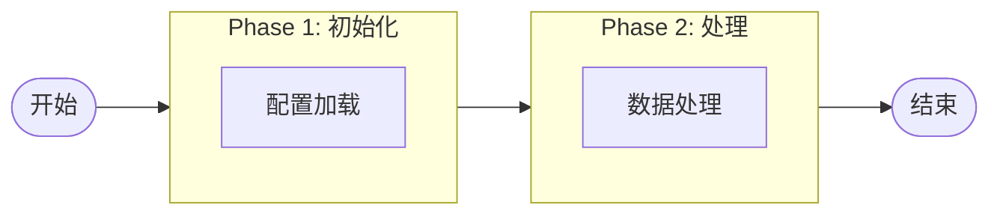
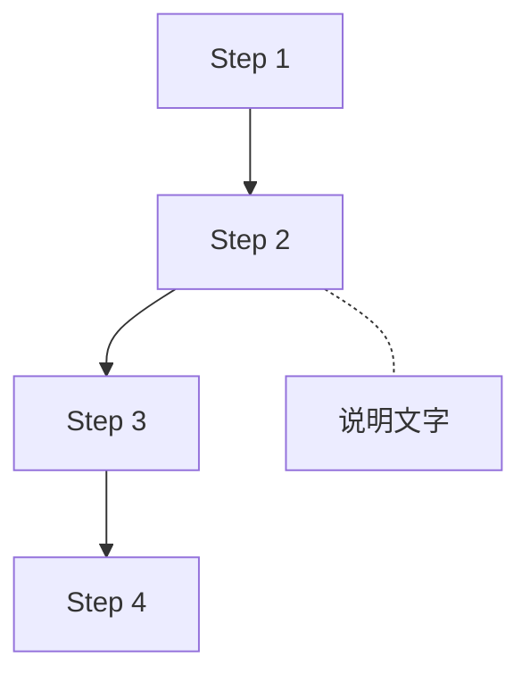
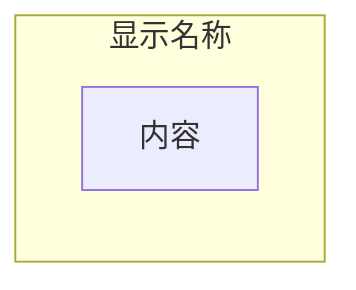
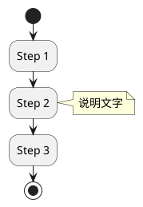

# Diagram 画图规范

> 文档中图表绘制的统一规范和最佳实践 (~10 min reference)

---

## Table of Contents

1. [Overview](#1-overview)
2. [推荐工具](#2-推荐工具)
3. [Mermaid 规范](#3-mermaid-规范)
4. [PlantUML 规范](#4-plantuml-规范)
5. [布局最佳实践](#5-布局最佳实践)
6. [IDE 配置](#6-ide-配置)
7. [常见问题](#7-常见问题)
8. [Related](#8-related)

---

## 1. Overview

本规范定义了在项目文档中绘制图表的统一标准，确保图表在不同 IDE 和 Markdown 渲染器中的一致性和可读性。

### 核心原则

| 原则 | 说明 |
|:-----|:-----|
| **简洁性** | 图表应简洁明了，避免过度复杂的样式 |
| **一致性** | 同一项目中使用统一的图表工具和风格 |
| **可维护性** | 代码易于阅读和修改 |
| **兼容性** | 优先选择 IDE 原生支持的工具 |

---

## 2. 推荐工具

### 工具选择优先级

| 优先级 | 工具 | 适用场景 | IDE 支持 |
|:-------|:-----|:---------|:---------|
| **P1** | Mermaid | 流程图、序列图、类图 | VS Code 原生, PyCharm 需插件 |
| **P2** | PlantUML | 复杂 UML 图、活动图 | PyCharm 原生支持 |
| **P3** | ASCII Art | 简单示意图、兼容性要求高 | 所有编辑器 |

### 选择建议

- **默认使用 Mermaid**：语法简洁，GitHub/GitLab 原生支持
- **PyCharm 用户**：如 Mermaid 渲染失败，可使用 PlantUML
- **极简场景**：使用 ASCII Art 确保最大兼容性

---

## 3. Mermaid 规范

### 3.1 流程图 (Flowchart)

**推荐布局方向：**

| 方向 | 代码 | 适用场景 |
|:-----|:-----|:---------|
| 从上到下 | `flowchart TD` | 垂直流程，步骤较多 |
| 从左到右 | `flowchart LR` | 水平流程，阶段展示 |

**示例 - 水平分阶段流程图：**



**示例 - 垂直流程图：**



### 3.2 节点样式

| 样式 | 语法 | 用途 |
|:-----|:-----|:-----|
| 矩形 | `[text]` | 普通步骤 |
| 圆角矩形 | `(text)` | 过程/操作 |
| 体育场形 | `(["text"])` | 开始/结束节点 |
| 菱形 | `{text}` | 判断/决策 |
| 六边形 | `{{text}}` | 准备/条件 |

### 3.3 连接线样式

| 样式 | 语法 | 用途 |
|:-----|:-----|:-----|
| 实线箭头 | `-->` | 主流程 |
| 虚线 | `-.-` | 注释/说明连接 |
| 带文字 | `--text-->` | 条件分支 |

### 3.4 分组 (Subgraph)



**最佳实践：**
- 使用 `subgraph` 分组相关节点
- 组名使用英文标识符，显示名称可使用中文
- 每个 subgraph 内保持 2-5 个节点

---

## 4. PlantUML 规范

### 4.1 活动图 (Activity Diagram)

**简洁模板：**



### 4.2 推荐的 skinparam 设置

```plantuml
@startuml
' 清晰度优化设置
skinparam shadowing false
skinparam defaultFontSize 14
skinparam backgroundColor transparent

' 可选：简化样式
skinparam activityShape rectangle
@enduml
```

### 4.3 注意事项

| 问题 | 解决方案 |
|:-----|:---------|
| 渲染模糊 | 减少复杂样式，使用 `skinparam shadowing false` |
| 字体不清晰 | 增大 `defaultFontSize` (建议 14-16) |
| 颜色失真 | 避免使用自定义颜色，使用默认配色 |

---

## 5. 布局最佳实践

### 5.1 流程图布局原则

| 原则 | 说明 |
|:-----|:-----|
| **阶段分组** | 使用 subgraph 将流程分为逻辑阶段 |
| **方向一致** | 整个图表保持统一的流向 |
| **节点数量** | 单个图表不超过 15 个节点 |
| **层级控制** | 嵌套层级不超过 2 层 |

### 5.2 命名规范

| 元素 | 规范 | 示例 |
|:-----|:-----|:-----|
| 节点 ID | 大写字母 + 数字 | `A1`, `B2`, `PHASE1` |
| 显示文本 | 简洁描述 | `["配置加载"]` |
| Subgraph ID | 大写英文 | `PHASE1`, `INIT` |
| Subgraph 显示名 | 可用中文 | `[Phase 1: 初始化]` |

### 5.3 复杂流程处理

当流程过于复杂时：
1. **拆分图表**：将大流程拆分为多个小图表
2. **层级展示**：先展示概览图，再展示详细图
3. **使用表格**：流程步骤较多时，考虑用表格代替图表

---

## 6. IDE 配置

### 6.1 PyCharm

**Mermaid 支持：**

1. 进入 `File` → `Settings` → `Languages & Frameworks` → `Markdown`
2. 在 "Markdown Extensions" 中勾选 `Mermaid`（如有）
3. 确保 Preview browser 设置为 `JCEF`

**PlantUML 支持：**

1. 进入 `File` → `Settings` → `Languages & Frameworks` → `Markdown`
2. 在 "Markdown Extensions" 中勾选 `PlantUML`
3. PlantUML 通常原生支持，无需额外配置

### 6.2 VS Code

**Mermaid 支持：**
- 内置支持，无需额外配置
- 推荐安装 "Markdown Preview Mermaid Support" 扩展

**PlantUML 支持：**
- 安装 "PlantUML" 扩展
- 需要本地安装 Java 和 Graphviz

### 6.3 GitHub/GitLab

| 平台 | Mermaid | PlantUML |
|:-----|:--------|:---------|
| GitHub | ✅ 原生支持 | ❌ 不支持 |
| GitLab | ✅ 原生支持 | ✅ 需配置 |

---

## 7. 常见问题

### Q1: Mermaid 在 IDE 中显示原始代码？

**解决方案：**
1. 检查 IDE 的 Markdown Extensions 设置
2. 确认是否启用了 Mermaid 扩展
3. 尝试重启 IDE
4. 如仍不可用，改用 PlantUML

### Q2: PlantUML 渲染清晰度差？

**解决方案：**
1. 减少自定义样式
2. 添加 `skinparam shadowing false`
3. 增大字体 `skinparam defaultFontSize 14`
4. 避免复杂的颜色配置

### Q3: 图表在不同平台显示不一致？

**解决方案：**
1. 使用最简单的语法
2. 避免平台特定的扩展语法
3. 测试目标平台的渲染效果
4. 必要时导出为图片

---

## 8. Related

- [BOOTSTRAP.md](../../../docs/design/core_engine/BOOTSTRAP.md) — 流程图示例
- [DOCUMENTATION_STANDARDS.md](DOCUMENTATION_STANDARDS.md) — 文档编写规范 (SSOT)
- [ASCII_ART_FORMATTING.md](ASCII_ART_FORMATTING.md) — ASCII 艺术格式规范
- [Mermaid 官方文档](https://mermaid.js.org/syntax/flowchart.html) — Mermaid 语法参考
- [PlantUML 官方文档](https://plantuml.com/) — PlantUML 语法参考

---

*Part of SAGE Knowledge Base*
