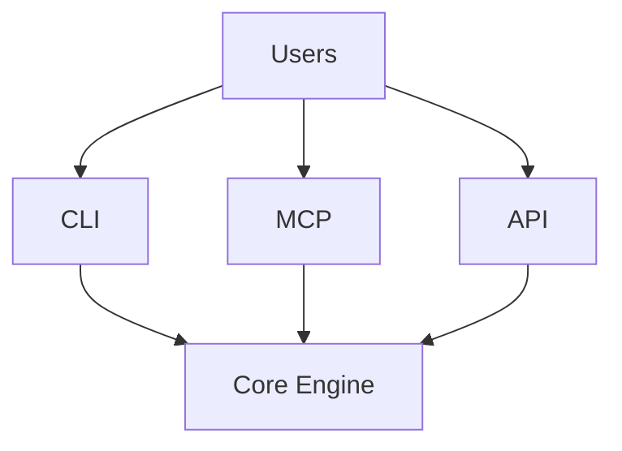

# Services

> Service layer design for SAGE interfaces

---

## 1. Overview

The services layer provides multiple interfaces (CLI, MCP, API) for interacting with SAGE.

---

## 2. Documents

| Document | Description | Status |
|----------|-------------|--------|
| `SERVICE_LAYER.md` | Service layer architecture | Active |
| `CLI_SERVICE.md` | Command-line interface | Active |
| `MCP_SERVICE.md` | Model Context Protocol service | Active |
| `API_SERVICE.md` | REST/HTTP API service | Active |

---

## 3. Service Architecture

---

## 4. Service Responsibilities

| Service | Channel | Use Case |
|---------|---------|----------|
| **CLI** | Terminal | Developer interaction |
| **MCP** | Protocol | AI assistant integration |
| **API** | HTTP | External integrations |

---

## 5. Common Features

All services share:

- Authentication/Authorization
- Request validation
- Error handling
- Logging and metrics
- Rate limiting

---

## Related

- `../architecture/INDEX.md` — Architecture overview
- `../core_engine/INDEX.md` — Core engine
- `../capabilities/INDEX.md` — Capabilities

---

*AI Collaboration Knowledge Base*
